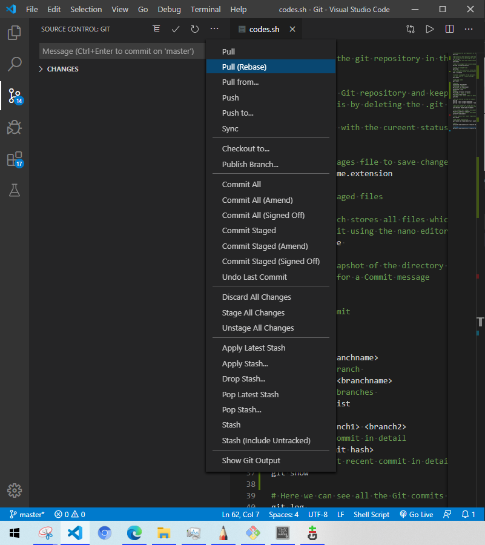
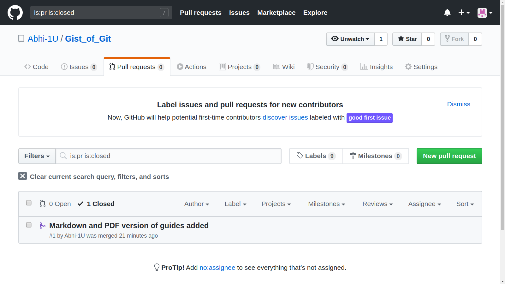

# Gist Of Git 

Git is a distributed Version Control System used to manage a code repository with various collaborators and tracking changes overtime. Git was developed by Linus Tolvards for better Source code management and later became a common staple among developers.
Over the years Git has transformed into the De-facto standard of version control systems. Git is one of the tools which might feel ugly to use with all those commands at stake but the underlying concept is very beautiful.

## Git and GitHub
To be clear GitHub is a collaboration platform by Github Inc. © . GitHub also offers various services includes Hosting of Project repositories(both private and public) ,websites and web-pages (git-hub pages) usually for documentation of open source projects and team collaboration tools.
  Git on the other hand is a local VCS which works independently and can work off line unless you want to connect it to remote repositories. Git manages your Project repository and manages them locally in your machine. If you want to have a copy of your project repositories to be made available public you can connect it to various sites which offer repository hosting capabilities such as GitHub and bitBucket.  
###### Note:  
     GitHub is not a backup tool! 

## Why use Git ?
 One of the most common problems i ran into frequently during my early Software development journey was managing different versions of code . Usually i used to create multiple folders with copies of code  plagued with complicated format and poorly named directories like 'last-version' ,'final-version','Ultimate-Version','post-Ultimate-Edition' and so on .. which made finding the appropriate code  very confusing and messed up.  
Now after learning and understanding git thoroughly i no longer make such mistakes and the coding work-flow is so much more streamlined and clear without distractions.  
Added advantage of git is that it manages versions in a compressed format which reduces space requirements and makes it feasible for working with less storage space.  
Git Commits also infuse a sense of responsibility to the developer while coding , because initializing git begins with your name and email address and further any of the commits you make are linked to you ,hence in a team collaboration or a corporate environment you could be held legible for the piece of code you write and this ensures you do not go out of line and stay focused. Take this point as a motivation , where something pushes you to become a better developer.  
Git is also a lifesaver when you unexpectedly delete some code or lose some information from current build or your current build fails due to some bug, you can always revert back to a previous commit and make a continuation from there.  
Git also has many more advantages and many creative use cases which were not intended as its original purpose. For instance Git logs can be a perfectly legitimate proof of your genuine work.

## Working of Git

Understanding working of git is the most important and beautiful part ,most developers can get started with using git within 10-15 minutes of explanation of commands briefly. But i would encourage you all to go through the document which will make the core concepts of git very clear .
 
### What Git Does
 Git takes a snapshot of the current working directory (excluding those files and subdirectories you mark to ignore) whenever you create a commit.  
 Git views the directory as a tree structure with subdirectories and other files. Git views any file type as a BLOB type which helps it to work with a wide range of files and file extensions and makes saving data easier. Git utilizes delta compression techniques to save these files in a `.git' directory .
   
Git at its heart is written in C language which should not be understated , Git views any directory or sub directory as a tree data Type and every other file format as a BLOB type . This helps git maintain a clear representation of objects in the directory . 

  However to identify each object uniquely to such an extent where changes even in a single bit of data can be identified, Git Uses Hash codes to uniquely represent each object.[SHA-1](https://en.wikipedia.org/wiki/SHA-1#Data_integrity) values of each object are generated within git to uniquely identify and store each object in a organized fashion.
  Git also takes care of human-readability and String based object identification by adding functionality to refer hash values by a user generated string. This functionality is called "references" in git.
  A special reference called **"HEAD"** points to the current  commit. 
### Structure of Git Commits
Git commits are objects that contain all the meta data and the changes in the directory, linked with the user and his/her previous commit. Commits are immutable objects which means once a commit object is created it can not be edited , however you can delete or create a new commit by using the commit as a base. No two Commits are same. Each commit is again referred by a hash value linked with it. The immutable nature of the commit objects make them robust and secure , which makes a lot of sense considering you cant change what happened in past. The SHA1 hash value maintains the integrity of data in the commit and prevents malicious changes. Any change in the commit data will change the Hash value and Git will recognize the change in hash value .
The General Chain of Commits can be visualized or represented by a chain of commits forming a DAG([Directed Acyclic Graph](https://en.wikipedia.org/wiki/Directed_acyclic_graph)) which cannot link back to any of its previous nodes and always goes forward in nature. 	  

### A small intro to SHA1 Hash
 SHA1 (Secure Hash Algorithm 1) is a commonly used hash algorithm which generates 160bit hash value typically rendered in 40 digits long hexadecimal format.  
 While the main topic of this article is not SHA1 we can still have some interactive hands on code to better understand this hash function and how it helps git.  
#### python Code  
 
```python
import hashlib
import sys
def sha1(argv):
    with open(argv, 'rb') as f:
        contents = f.read()
    m = hashlib.sha1()
    m.update(contents)
    print("SHA1 Value of file:",m.hexdigest())
if __name__ == "__main__":
    arg=sys.argv[1]
    sha1(arg)

```

#### Output:  

```bash  
$ python3 ./sha1.py sha1.py
SHA1 Value of file: 664050f9ac17a676c2a4d8f6dc63058093d959ea  
```

## Various Ways of Using Git

### Git Bash/Terminal
The Traditional way to work with Git has always been the command line interface . Hate it or Love it , many developers grow accustomed to the commands in their daily use while others find it painful to remember the commands. However terminal versions of Git are guaranteed to work on every environment and platform where GUI versions might not make the cut.\newline
Download them from [here](https://git-scm.com/downloads).


### Git GUI
Git GUI versions are also available and many third party software also exist which provide different look and feel .GUI versions offer the same functionality as the CLI version but can be visually appealing;
 However if you are interested
 Download them from [here](https://git-scm.com/downloads/guis/).

### Integrated with IDE's
Many third Party Integrated Development Environments(IDE's) come with Built-in Git Support . These plug ins are the easiest to use and a simple way for a beginner to work with git efficiently. These tools make sure all things you need are at a single place and you only need to focus on coding.
Some of the Top ranked IDE's with Git support  
1.[Microsoft Visual Studio Code](https://code.visualstudio.com/)  
2.[Microsoft Visual Studio](https://visualstudio.microsoft.com/vs/community/)  
3.[Atom](https://atom.io/)  
4.[NetBeans](https://netbeans.org/)  
5.[Vim](https://www.vim.org/download.php)  
6.Xcode(MacOS only)  
And Many more ...Search Engine is you Guide.

## GitHub
Earlier we talked about Git and GitHub being different ,yes they are. One way to say this is GitHub offers Services and features continuing where git left.  
GitHub offers repository hosting services to both teams/organizations and individual developers . One can collaborate with open source developers in many ways like.
### Raising Genuine Issues on their GitHub Page
This can be done by bringing genuine issues or bugs to the notice of developers . This can be a great start and very useful to the community .
	However one should always search on the web or forums for similar issues and questions about it , as it may be possible that these issues or bugs have been resolved or are not resolvable in the current capacity of the software .  
	Developers work hard day and night ,so don't post some in-genuine Issues or bugs which might be due to mistake from your side.Always read the relevant documentation thoroughly.

### Pull Requests
This way of contribution is to offer some changes in the source code of the developers repository and to merge them with the original code base hosted in the developers repository. These types of contributions are often popular in open source developments but be wary of Licenses, the terms of use and the guidelines given by developer for contribution . A pull request is raised when you have some improved , bug fixing or modified code to offer which is then approved/rejected by the developer and merged in accordance to his/her wishes.  


### GitHub Pages
 One of the perks of using Github is it lets you host webpages; sort of.
 Obviously it does not offer a complete dedicated webserver.  
 One user/organization site per GitHub Account is provided, however you get unlimited repository websites (In layman terms, one website per project repository ,limited by the number of project repositories you make you make).  
 Obviously there are restrictions for free accounts :
 
* GitHub Pages source repositories have a recommended limit of 1GB. For more information, see ["What is my disk quota?"](https://help.github.com/en/articles/what-is-my-disk-quota/#file-and-repository-size-limitations).  

* Published GitHub Pages sites may be no larger than 1 GB.

* GitHub Pages sites have a soft bandwidth limit of 100GB per month.

* GitHub Pages sites have a soft limit of 10 builds per hour.
  
However there are many more terms and conditions that you need to adhere to which primarily discourages **"Use of GitHub pages for Commercial and Illegal Purposes"**.
[Here](https://help.github.com/en/github/working-with-github-pages/about-github-pages) is a quick link to the official documentation for in-depth information and clarity.

There are two ways to deploy or generate a website on GitHub:
##### 1. Traditional HTML 
 you can create a docs sub folder in your repository and create a traditional html website as you would do normally. You can use other features like CSS and Javascript as well but GitHub pages does not support any kind of Backend :( .  
##### 2. Jekyll with Markdown Files
Markdown is a lightweight Markup language which can be used to generate documents of various formats . Its Used commonly by developers for writing README files and Documentation files as well . The current page you are reading is written in markdown as well hence if you are interested in its inner workings of syntax it might be a good idea to look under the hood of the source code and obviously Markdown in its own right deserves a dedicated Article hence i wont be elaborating it.

I leave the choice upon the reader to use whichever way they feel comfortable with.   

### Advanced Topics
Well as this article was for beginners, some topics like GPG encryption key signing your work , were not feasible and are left as a Exploration task for the reader.  
[Signing your git Commits and Tags](https://git-scm.com/book/en/v2/Git-Tools-Signing-Your-Work). 
## Git Cheat Sheet

```bash  
# Get Help
git help

# initializes the git repository in the directory 
git init

# Uninitialize Git repository and keep the directory at the latest version
# We can do this by deleting the .git folder
rm -rf .git

# Updates user with the cureent status of files and untracked files
git status

# Adds file/stages file to save changes
git add filename.extension

# clear all staged files
git clean

# the file which stores all files which we do not want to track
# we can edit it using the nano editor or any other editor
nano .gitignore 

# creates a snapshot of the directory at the current moment 
# it will ask for a Commit message
git commit

# undo the commit
git revert

# branch
git branch <branchname>

# deleting a branch 
git branch -d <branchname>

# listing all branches 
git branch --list

#merge
git merge <branch1> <branch2>

# displays a commit in detail
git show <commit hash>

# displays most recent commit in detail
git show

# Here we can see all the Git commits done to our directory 
git log 

# a more decorated representation
git log --all --graph --decorate

# a more decorated and compact representation 
git log --all --graph --decorate --oneline

# with this command we can go back in history to a commit and view the
# directory files as if we were in that moment
git checkout <hash name of commit>

# this command will compare two commits and give the difference 
# for a specific file
git diff <commit1> <commit2> <filename>

# this command will compare the commit with current HEAD commit
# in general
git diff <somecommit>

# this command will compare the commit with current HEAD commit
# specific to a file
git diff <somecommit> <filename>

# rebase your changes to another commit
git rebase


# shows names of all remote repositories added
git remote

# add remote repositories
git remote add <name/identifier> <path or url>

# push 
git push <name/identifier> <branch>:<branch>

# pull
git pull <name/identifier> <branch>:<branch>

# clone a repository into your local machine
git clone

#fetch the changes from the remote repository
git fetch

#Advanced Topics Read The Documentation Before using them
# configuring Git
git config 

# blame -usefull in multiple collaborators /teams
# to show who last edited which line
git blame

#stash -temporarily remove modifications to working directory
git stash

#bisect -binary search history (e.g. for regressions)
git bisect

# a fancy tool for handline mergers
git mergetool
```

## References and Further Reading
Its always a best practice to maintain a continuum with reading and learning about something you have already begun , don't stop at the end of this notes ,Keep going further deep.  
1.The Ultimate Guide Book you will need  
[Git pro Book](https://git-scm.com/book/en/v2)  
2.Another Good Resource for learning  
[Learning Git branch](https://learngitbranching.js.org/)  
3.Guidance on Writing Good commit messages  
[Writing Good Git commit messages](https://tbaggery.com/2008/04/19/a-note-about-git-commit-messages.html)  
4.For the Curious minds  
[Git from Bottom up](https://jwiegley.github.io/git-from-the-bottom-up/)  
5.If you mess up with git  
[Oh Shit Git](https://ohshitgit.com/)  
6.For better understanding of Git and its workings with fancy diagrams  
[Git for computer scientists](https://eagain.net/articles/git-for-computer-scientists/)  
7.For those who want Linux environment in their PCs.  
Better than Linux VM worse than Clean install of Linux.  
[Windows Subsystem for Linux](https://docs.microsoft.com/en-us/windows/wsl/about)    
8.For Learning more tools like git    
[The Missing semester](https://missing.csail.mit.edu/)  
9.MarkDown Guide for Beginners  
[MarkDownGuide](https://www.markdownguide.org/getting-started/)

Licensed Under [CC BY-NC-SA](https://creativecommons.org/licenses/by-nc-sa/4.0).